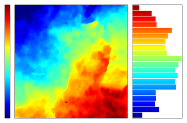
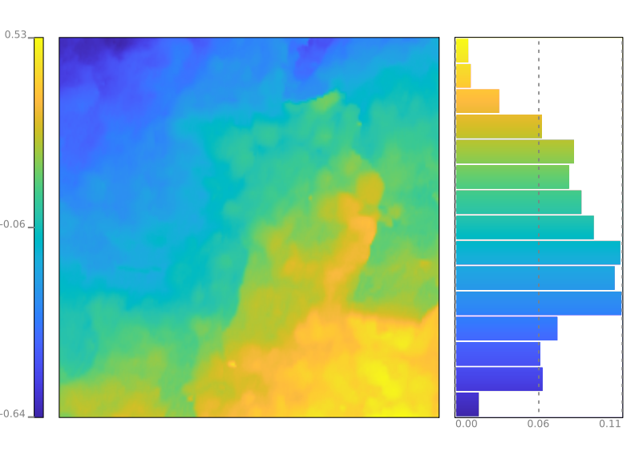

# tiff2svg
Matlab script to prepare geoTIFF and other single band images for presentation. Applies colourmap to both map and corresponding histogram. 
The resulting figure is exported as SVG (PNG internally stored) with separate layer for background, histogram and caption.

SVG

PNG

